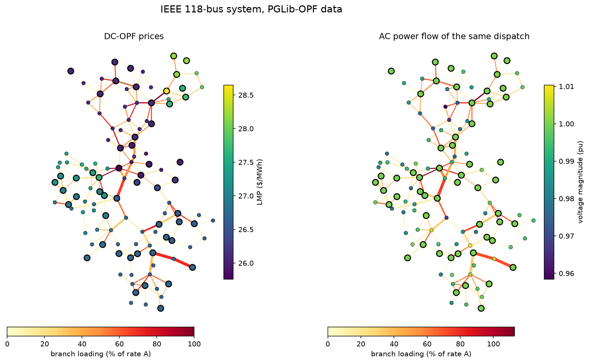

# swingbus

[](https://github.com/akeanti/swingbus/actions/workflows/ci.yml)
[](pyproject.toml)
[](pyproject.toml)
[](LICENSE)
[](src/swingbus/cases/NOTICE.md)

Power flow, N-1 screening, DC optimal power flow with LMPs, and cascading failure simulation for transmission grids. Plain NumPy and SciPy in about 3,000 lines of Python, with results checked against PYPOWER on every commit.



swingbus reads MATPOWER case files directly, ships the IEEE test systems and the PGLib-OPF benchmarks, and fetches the other 56 PGLib-OPF grids (up to 78,484 buses) on demand. It is meant for the space between a textbook and a production tool: small enough to read in an afternoon, accurate enough to publish with.

## Install

```bash
pip install "swingbus[plot] @ git+https://github.com/akeanti/swingbus"
```

The only runtime dependencies are NumPy and SciPy. The `plot` extra adds matplotlib.

## Quick start

```python
import swingbus as sb

case = sb.load("case14")
result = sb.runpf(case)
print(result)
```

```text
case14 | Newton-Raphson | converged in 2 iterations (1.9 ms)
14 buses, 5 generators, 20 branches, base 100 MVA

                P (MW)  Q (MVAr)
-------------  -------  --------
generation     272.393    82.438
load           259.000    73.500
branch losses   13.393    30.122
bus shunts       0.000   -21.185

voltage  min 1.0100 pu at bus 3, max 1.0900 pu at bus 8
angle    largest -16.034 deg at bus 14
```

Every result keeps the solved case in MATPOWER layout, so `result.vm`, `result.va`, `result.pg`, `result.pf` and `result.loading()` are NumPy arrays aligned with the rows of the input, and `result.case` can be saved with `sb.write_matpower`.

The same functions are on the command line:

```bash
swingbus pf case118 --qlim
swingbus opf pglib_opf_case5_pjm
swingbus n1 pglib_opf_case118_ieee --from-opf
swingbus cascade pglib_opf_case118_ieee --from-opf -o 8 5 -o 26 30
```

## What it does

| task | function | notes |
|---|---|---|
| AC power flow | `runpf(case, method)` | Newton-Raphson, fast-decoupled XB and BX, Gauss-Seidel; flat, DC or case start; generator Q limits |
| DC power flow | `rundcpf(case)` | phase shifters and shunt conductance included |
| Sensitivities | `ptdf(case)`, `lodf(case)` | single or distributed slack; islanding outages flagged |
| N-1 screening | `n1(case, method="dc" or "ac")` | all single branch outages, ranked; AC mode also reports voltage violations and divergence |
| DC optimal power flow | `rundcopf(case)` | quadratic and piecewise-linear costs, thermal and angle limits, LMPs and shadow prices |
| Economic dispatch | `economic_dispatch(case)` | exact lambda solution, no iteration tolerance |
| Cascading failures | `cascade(case, outages)`, `sample_cascades(case, n)` | DC overload cascade with islanding, load shedding and redispatch |
| Case data | `load`, `fetch`, `read_matpower`, `write_matpower` | MATPOWER `.m` in and out, 15 bundled cases, 66 PGLib-OPF cases by name |
| Plots | `swingbus.plot` | network maps with an automatic layout, voltage profiles, convergence |

## Examples

### Locational marginal prices on the PJM 5-bus system

```python
result = sb.rundcopf("pglib_opf_case5_pjm")
print(result.lmp.round(2))
```

```text
[16.98 26.38 30.   39.94 10.  ]
```

One binding line between buses 4 and 5 splits a single 30 $/MWh price into five, and costs 2,669.90 $/h compared with an unconstrained network. With PTDFs each price splits into an energy part and a congestion part, and the tests check that identity to machine precision.

### N-1 screening of the IEEE 118-bus system

```bash
swingbus n1 pglib_opf_case118_ieee --from-opf --top 5
```

```text
N-1 DC screening of pglib_opf_case118_ieee | 186 outages | 9 islanding | 123 with overloads | 0 diverged | 8.3 ms

rank  outage  max load (%)  worst branch  overloads  status
----  ------  ------------  ------------  ---------  ---------
   1  65-68          287.0  49-69                 6  violation
   2  81-80          193.6  77-80                 5  violation
   3  68-81          193.6  77-80                 5  violation
   4  8-5            161.8  15-17                 4  violation
   5  68-69          157.5  49-69                 3  violation
```

The whole N-1 set takes one PTDF, one LODF and a few matrix products. A cost-optimal dispatch without security constraints is far from N-1 secure, which is the reason security-constrained OPF exists.

### Cascading failures and graph datasets

```python
for sample in sb.sample_cascades("pglib_opf_case118_ieee", 1000, k=2, seed=0):
    print(sample.initial, sample.tripped, sample.shed)
```

Each scenario draws a load level, dispatches it with DC-OPF at 90 % of the thermal ratings, removes `k` random branches and runs the cascade until no branch is overloaded. [`examples/05_cascade_dataset.py`](examples/05_cascade_dataset.py) turns the samples into node features, edge features and labels (demand not served, cascade or not, which branches tripped) in an `.npz` file ready for a graph neural network. It was written as a data generator for [cascade-gnn](https://github.com/akeanti/cascade-gnn).

More scripts are in [`examples/`](examples): solver comparison, the full IEEE 14-bus report, AC N-1 on the worst DC cases, and the figure at the top of this page.

## Accuracy

On the IEEE 14, 30, 57, 118 and 300-bus systems, all three main power flow methods agree with PYPOWER to better than 1e-13 pu in voltage and 1e-10 MW in branch flow, with the same iteration counts. DC-OPF costs agree to 3e-8 relative and LMPs to 3e-5 $/MWh on fifteen systems. The full tables, and what is checked against physics rather than against another program, are in [docs/validation.md](docs/validation.md).

## Speed

Newton-Raphson, including building the matrices, on one laptop core:

| case | buses | iterations | time |
|---|---:|---:|---:|
| IEEE 118 | 118 | 3 | 2.9 ms |
| IEEE 300 | 300 | 5 | 6.8 ms |
| PEGASE 1354 | 1,354 | 5 | 23 ms |
| Polish 2383 | 2,383 | 5 | 42 ms |
| PEGASE 9241 | 9,241 | 7 | 0.27 s |

The Jacobian is never rebuilt from sparse matrix products. Its sparsity pattern is worked out once, and each iteration fills the values in O(nnz).

## Documentation

- [Theory](docs/theory.md): every equation the code implements, from the branch model to the interior point method, with references.
- [Validation and performance](docs/validation.md): how results are checked, and the measured numbers.
- [Test cases](docs/cases.md): the bundled systems, PGLib-OPF downloads, and building a case in code.

## How it compares

[MATPOWER](https://matpower.org) is the reference for this kind of analysis and swingbus follows its formulations and data format closely. [pandapower](https://www.pandapower.org) and [PyPSA](https://pypsa.org) are larger frameworks with their own data models, many more component types and active communities; use them for distribution grids, unbalanced networks, or energy system planning. swingbus is deliberately narrower: MATPOWER cases in, NumPy arrays out, a code base you can read end to end, and a direct path from a power flow to N-1 statistics, prices and cascade datasets.

## Citing

If swingbus helps your research, please cite it. GitHub shows a "Cite this repository" button generated from [CITATION.cff](CITATION.cff).

```bibtex
@software{essamit_swingbus,
  author  = {Essamit, Elmehdi},
  title   = {swingbus: power flow, contingency analysis and DC optimal power flow in Python},
  url     = {https://github.com/akeanti/swingbus},
  version = {0.1.0},
  year    = {2026}
}
```

Please also cite the sources of any test system you use; they are listed in [the data notice](src/swingbus/cases/NOTICE.md).

## Contributing

Bug reports with a case file that reproduces them are the most useful contribution. See [CONTRIBUTING.md](CONTRIBUTING.md) for the development setup. Every change runs the full test suite, including the PYPOWER comparison, on Linux, macOS and Windows.

## License

The code is released under the [MIT License](LICENSE). The bundled case data is CC BY 4.0, see [NOTICE.md](src/swingbus/cases/NOTICE.md).
