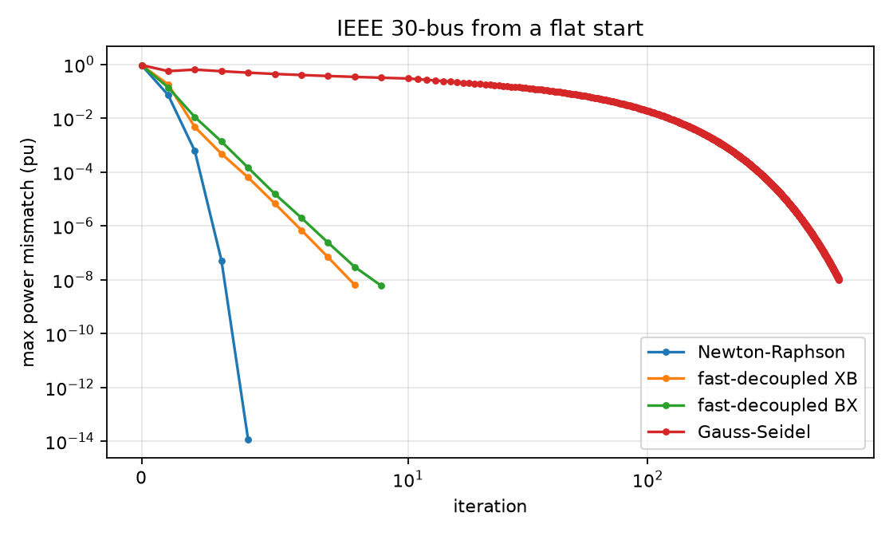

# Theory

This page derives every quantity swingbus computes, in the order the code computes it. The notation follows MATPOWER, so the same symbols appear in the source, in the MATPOWER manual and in most textbooks. All quantities are per unit on the system base $S_\text{base}$ (`base_mva`) unless a unit is given.

## 1. Network model

### Branches

Every line and transformer is a $\pi$ model with series admittance $y_s = 1/(r + jx)$, total charging susceptance $b_c$ and a complex turns ratio $\tau = t\,e^{j\theta_\text{shift}}$ on the from side. A plain line has $t = 1$ and $\theta_\text{shift} = 0$ (MATPOWER stores $t = 0$ for "no transformer").

$$
\begin{bmatrix} I_f \\ I_t \end{bmatrix}
=
\begin{bmatrix}
\dfrac{y_s + j b_c/2}{|\tau|^2} & -\dfrac{y_s}{\tau^*} \\[2ex]
-\dfrac{y_s}{\tau} & y_s + j b_c/2
\end{bmatrix}
\begin{bmatrix} V_f \\ V_t \end{bmatrix}
$$

Stacking the first rows of all branches gives the matrix $Y_f$, stacking the second rows gives $Y_t$. Both are `n_branch x n_bus` and sparse.

### Bus admittance matrix

With connection matrices $C_f$ and $C_t$ (entry 1 where branch $l$ starts or ends at bus $i$) and shunt admittances $y_\text{sh} = (G_s + jB_s)/S_\text{base}$:

$$
Y_\text{bus} = C_f^\top Y_f + C_t^\top Y_t + \operatorname{diag}(y_\text{sh})
$$

`make_ybus` builds the three matrices in one pass from coordinate triplets. It is symmetric unless the network contains phase shifters.

## 2. Power flow equations

The complex power injected at every bus must equal generation minus demand:

$$
\mathbf{S}(V) = \operatorname{diag}(V)\,(Y_\text{bus} V)^* = S_g - S_d
$$

Each bus fixes two of its four quantities $(P, Q, |V|, \theta)$:

| type | known | unknown |
|---|---|---|
| reference (slack) | $\lvert V\rvert$, $\theta$ | $P$, $Q$ |
| PV (generator) | $P$, $\lvert V\rvert$ | $Q$, $\theta$ |
| PQ (load) | $P$, $Q$ | $\lvert V\rvert$, $\theta$ |

The unknown vector is $x = [\theta_{pv}, \theta_{pq}, |V|_{pq}]$ and the mismatch is

$$
F(x) =
\begin{bmatrix}
\operatorname{Re}\,\Delta S_{pv} \\
\operatorname{Re}\,\Delta S_{pq} \\
\operatorname{Im}\,\Delta S_{pq}
\end{bmatrix},
\qquad
\Delta S = \operatorname{diag}(V)\,(Y_\text{bus} V)^* - S_\text{bus}.
$$

A solution is accepted when $\lVert F \rVert_\infty < 10^{-8}$ (`tol`).

### Newton-Raphson

Newton's method solves $J\,\Delta x = -F$ at every iteration [Tinney and Hart 1967]. With $I = Y_\text{bus} V$, the derivatives of the complex injections in polar form are

$$
\frac{\partial \mathbf S}{\partial \theta} = j\,\operatorname{diag}(V)\,\big(\operatorname{diag}(I) - Y_\text{bus}\operatorname{diag}(V)\big)^*
$$

$$
\frac{\partial \mathbf S}{\partial |V|} = \operatorname{diag}(V)\,\big(Y_\text{bus}\operatorname{diag}(V/|V|)\big)^* + \operatorname{diag}(I)^*\operatorname{diag}(V/|V|)
$$

and the Jacobian is assembled from their real and imaginary parts:

$$
J =
\begin{bmatrix}
\operatorname{Re}\dfrac{\partial \mathbf S_{pv,pq}}{\partial \theta_{pv,pq}} & \operatorname{Re}\dfrac{\partial \mathbf S_{pv,pq}}{\partial |V|_{pq}} \\[2ex]
\operatorname{Im}\dfrac{\partial \mathbf S_{pq}}{\partial \theta_{pv,pq}} & \operatorname{Im}\dfrac{\partial \mathbf S_{pq}}{\partial |V|_{pq}}
\end{bmatrix}
$$

Both derivative matrices have the sparsity pattern of $Y_\text{bus}$. `JacobianPattern` works out once where every nonzero of $Y_\text{bus}$ lands in $J$, so each iteration only evaluates $O(\text{nnz})$ complex products and hands a ready CSC matrix to SuperLU. The test suite checks this against the matrix formulas above to $10^{-10}$. Close to the solution the error is squared at every step:

### Fast-decoupled

At transmission voltages $\partial P/\partial |V|$ and $\partial Q/\partial \theta$ are small, and the remaining blocks are close to constant. The fast-decoupled method [Stott and Alsac 1974] replaces them with two constant matrices that are factorized once:

$$
B'\,\Delta\theta = -\frac{\Delta P}{|V|}, \qquad B''\,\Delta|V| = -\frac{\Delta Q}{|V|}
$$

$B'$ is built without shunts, line charging and tap magnitudes; $B''$ without phase shifts. The XB variant drops series resistance from $B'$, the BX variant drops it from $B''$ [van Amerongen 1989]. Each half iteration is a forward and back substitution, so iterations are cheap but convergence is linear.

### Gauss-Seidel

The textbook method updates one voltage at a time:

$$
V_k \leftarrow V_k + \frac{1}{Y_{kk}}\left(\frac{S_k^*}{V_k^*} - \sum_j Y_{kj} V_j\right)
$$

At PV buses the reactive injection is recomputed before the update and the magnitude is reset afterwards. It is included for teaching; it needs hundreds of iterations on the IEEE cases.

### Reactive power limits

With `enforce_q_limits=True` the solver runs, finds generators at PV buses whose $Q_g$ is outside $[Q_\text{min}, Q_\text{max}]$, fixes their output at the violated limit, turns their buses into PQ buses and solves again until no limit is violated. Reference bus generators are not limited, because they close the power balance. The result reports which generators were held at a limit in `q_limited`.

## 3. DC power flow

Assume flat voltage magnitudes, small angle differences, $r \ll x$ and no shunts. The flow on branch $l$ becomes linear in the angles, $P_l = b_l(\theta_f - \theta_t - \theta_\text{shift})$ with $b_l = 1/(x_l t_l)$, and the network reduces to

$$
B_\text{bus}\,\theta = P_\text{bus} - P_\text{bus,inj}, \qquad P_f = B_f\,\theta + P_{f,\text{inj}},
$$

where $B_f = \operatorname{diag}(b)\,C_{ft}$, $B_\text{bus} = C_{ft}^\top B_f$ and the injections $P_{f,\text{inj}} = -b \circ \theta_\text{shift}$ model phase shifters. One sparse solve gives the angles of all non-reference buses.

## 4. Sensitivity factors

### PTDF

The power transfer distribution factor $H_{l,i}$ is the change of flow on branch $l$ when one MW is injected at bus $i$ and withdrawn at the slack $s$:

$$
H = B_f\,B_\text{bus}^{-1} \quad (\text{reduced by the slack row and column, slack column } = 0)
$$

For a distributed slack with participation weights $w$ ($\sum w = 1$), $H_w = H - (H w)\,\mathbf 1^\top$.

### LODF

When branch $k$ trips, its pre-outage flow $F_k$ redistributes. The line outage distribution factor follows from the PTDF of a transfer between the two ends of $k$ [Guo et al. 2009]:

$$
L_{lk} = \frac{H_{l,f(k)} - H_{l,t(k)}}{1 - \big(H_{k,f(k)} - H_{k,t(k)}\big)},
\qquad
F_l' = F_l + L_{lk}\,F_k .
$$

The denominator vanishes exactly when branch $k$ is a bridge of the network graph, that is, when its outage creates an island. swingbus marks those columns as `NaN` and finds bridges independently with Tarjan's algorithm [Tarjan 1974]; the tests check that both agree.

### N-1 screening

The DC screen evaluates $F + L\,\operatorname{diag}(F)$ in blocks of 256 outages, which is the whole N-1 set for the cost of one dense matrix product per block. The AC screen re-solves Newton-Raphson for every non-islanding outage, warm-started from the base case, and also reports voltage violations and divergence.

## 5. DC optimal power flow

The decision variables are the bus angles $\theta$ and generator outputs $P_g$:

$$
\begin{aligned}
\min_{\theta, P_g}\quad & \sum_g c_{2,g} P_g^2 + c_{1,g} P_g + c_{0,g} \\
\text{s.t.}\quad & B_\text{bus}\theta + P_\text{bus,inj} + P_d + G_s = C_g P_g && \text{(nodal balance)} \\
& \theta_\text{ref} = \theta_\text{ref}^0 \\
& -F^\text{max} \le B_f\theta + P_{f,\text{inj}} \le F^\text{max} && \text{(thermal limits)} \\
& \theta^\text{min}_{ft} \le \theta_f - \theta_t \le \theta^\text{max}_{ft} && \text{(angle difference limits)} \\
& P_g^\text{min} \le P_g \le P_g^\text{max}
\end{aligned}
$$

Piecewise-linear costs are handled with one epigraph variable per generator, $y_g \ge m_k (P_g - p_k) + c_k$ for every segment, which keeps the problem a convex QP.

### Locational marginal prices

The price at bus $i$ is the marginal cost of serving one more MW there, which is the dual of its balance row divided by $S_\text{base}$. With PTDFs it splits into an energy part and a congestion part:

$$
\lambda_i = \lambda_\text{ref} - \sum_l \big(\mu_l^{+} - \mu_l^{-}\big)\,H_{l,i}
$$

where $\mu^\pm$ are the shadow prices of the upper and lower thermal limits (`MU_SF`, `MU_ST`). The identity holds to machine precision in the tests, and a finite-difference test checks that $\lambda_i$ really is $\partial\,\text{cost}/\partial P_{d,i}$. On the PJM 5-bus case one congested line spreads the prices from 10 to 39.94 $/MWh.

### Interior point solver

`swingbus.qp.solve_qp` solves

$$
\min_x \tfrac12 x^\top H x + c^\top x \quad \text{s.t.}\quad A x = b,\; G x \le h
$$

with a primal-dual interior point method and Mehrotra's predictor-corrector [Mehrotra 1992]. Eliminating the slacks $s$ and inequality duals $z$ leaves one sparse symmetric system per iteration,

$$
\begin{bmatrix} H + G^\top \operatorname{diag}(z/s)\,G & A^\top \\ A & 0 \end{bmatrix}
\begin{bmatrix} \Delta x \\ \Delta y \end{bmatrix} = r,
$$

factorized once and reused for the predictor and the corrector. The objective is scaled before solving and the duals are scaled back. On the bundled cases it converges in 6 to 15 iterations and agrees with PYPOWER's solver to within $3\times10^{-8}$ in relative cost.

## 6. Economic dispatch

Without a network, the optimum equalizes incremental costs. For quadratic costs each unit produces $P_g(\lambda) = \operatorname{clip}\big((\lambda - c_{1,g})/2c_{2,g},\,P_g^\text{min},\,P_g^\text{max}\big)$, and total output is a piecewise-linear, non-decreasing function of $\lambda$. `economic_dispatch` evaluates it at its breakpoints and solves the bracketing segment exactly, so there is no iteration tolerance. Units with linear costs are handled as steps in the same function, which gives the merit order.

## 7. DC cascade model

`cascade` repeats four steps until nothing else trips:

1. Find the islands of the energized network.
2. In every island without generation, shed all load and de-energize it. In every other island, shed load proportionally if demand exceeds capacity, move the generation to match demand in proportion to unit capacity, and make the largest unit the slack.
3. Solve a DC power flow.
4. Trip every branch above `overload` times its rating (`trip="all"`) or only the most loaded one (`trip="worst"`).

The result records the branches tripped at each stage and the demand not served. This is the quasi-steady-state DC model used in much of the cascading-failure literature, close to the fast dynamics of the OPA model [Dobson et al. 2007]. It has no protection relays, no dynamics and no voltage collapse, so it is a different model from the AC cascade simulations behind datasets such as PowerGraph [Varbella et al. 2024]. `sample_cascades` draws random load levels and N-k outages, dispatches each scenario with DC-OPF using `margin` times the ratings, and then runs the cascade against the full ratings.

## References

- R. D. Zimmerman, C. E. Murillo-Sanchez and R. J. Thomas, "MATPOWER: Steady-State Operations, Planning, and Analysis Tools for Power Systems Research and Education," *IEEE Transactions on Power Systems*, 26(1):12-19, 2011.
- W. F. Tinney and C. E. Hart, "Power Flow Solution by Newton's Method," *IEEE Transactions on Power Apparatus and Systems*, PAS-86(11):1449-1460, 1967.
- B. Stott and O. Alsac, "Fast Decoupled Load Flow," *IEEE Transactions on Power Apparatus and Systems*, PAS-93(3):859-869, 1974.
- R. A. M. van Amerongen, "A General-Purpose Version of the Fast Decoupled Load Flow," *IEEE Transactions on Power Systems*, 4(2):760-770, 1989.
- J. Guo, Y. Fu, Z. Li and M. Shahidehpour, "Direct Calculation of Line Outage Distribution Factors," *IEEE Transactions on Power Systems*, 24(3):1633-1634, 2009.
- R. E. Tarjan, "A Note on Finding the Bridges of a Graph," *Information Processing Letters*, 2(6):160-161, 1974.
- S. Mehrotra, "On the Implementation of a Primal-Dual Interior Point Method," *SIAM Journal on Optimization*, 2(4):575-601, 1992.
- A. J. Wood, B. F. Wollenberg and G. B. Sheble, *Power Generation, Operation, and Control*, 3rd ed., Wiley, 2014.
- I. Dobson, B. A. Carreras, V. E. Lynch and D. E. Newman, "Complex Systems Analysis of Series of Blackouts: Cascading Failure, Critical Points, and Self-Organization," *Chaos*, 17(2):026103, 2007.
- A. Varbella, K. Amara, B. Gjorgiev, M. El-Assady and G. Sansavini, "PowerGraph: A Power Grid Benchmark Dataset for Graph Neural Networks," NeurIPS Datasets and Benchmarks Track, 2024.
- E. R. Gansner, Y. Koren and S. North, "Graph Drawing by Stress Majorization," *Graph Drawing 2004*, LNCS 3383:239-250, 2005.
